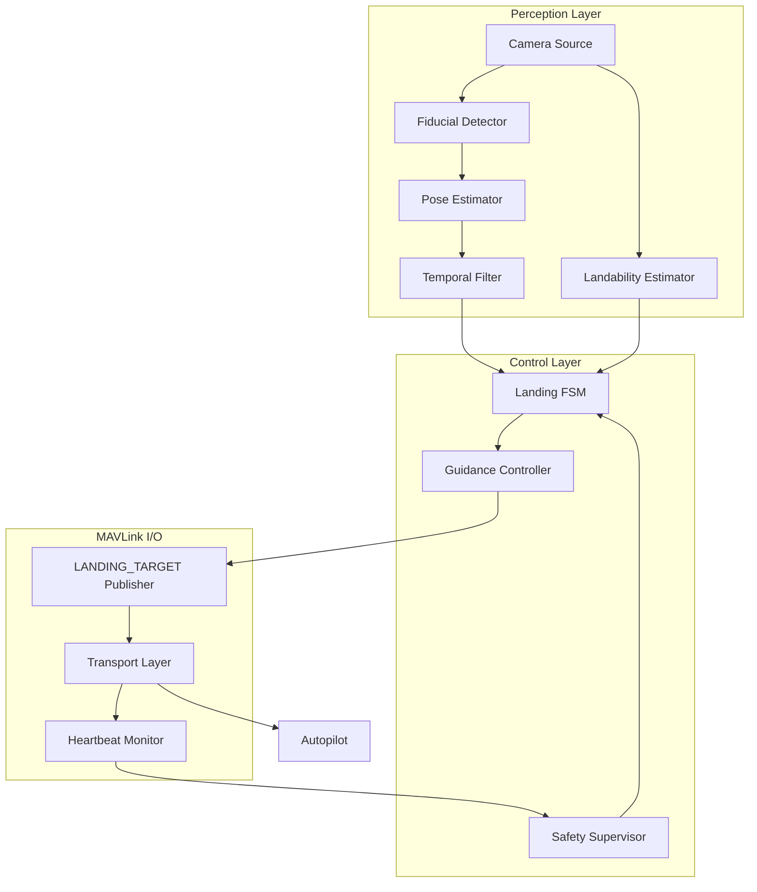
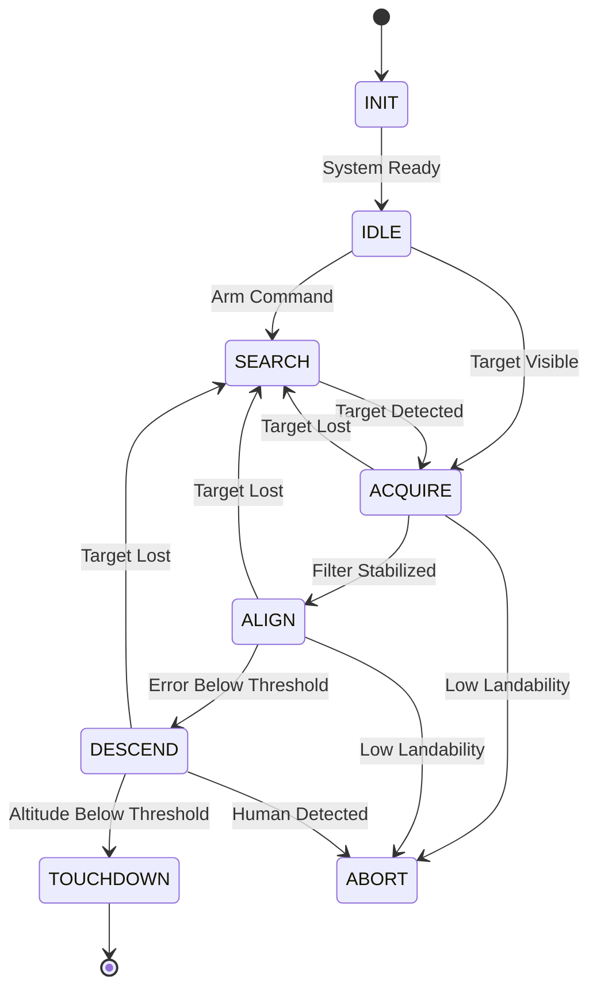

# System Architecture

This document describes the architectural design of the Scandium precision landing system, including component structure, data flow, and integration patterns.

## Architectural Overview

Scandium employs a layered architecture comprising four primary subsystems: Perception, Control, MAVLink I/O, and Simulation. Each layer operates with well-defined interfaces to enable modularity, testability, and maintainability.



## Layer Specifications

### Perception Layer

The perception layer is responsible for visual processing and target localization. It operates at the camera frame rate (typically 30 Hz) and produces pose estimates for consumption by the control layer.

#### Components

| Component | Module | Responsibility |
|-----------|--------|----------------|
| Camera Source | `perception/camera.py` | Frame acquisition from UVC, video file, or AirSim sources |
| Fiducial Detector | `perception/fiducials/` | ArUco and AprilTag marker detection |
| Pose Estimator | `perception/pose/pnp.py` | PnP-based 6-DOF pose estimation |
| Temporal Filter | `perception/pose/filtering.py` | Exponential smoothing and Kalman filtering |
| Landability Estimator | `perception/landability/` | Landing zone safety assessment |

#### Data Flow

1. Camera source acquires BGR frame with timestamp
2. Frame is converted to grayscale for fiducial detection
3. Detected markers are filtered by ID allowlist and minimum area
4. solvePnP computes camera-frame pose for each valid detection
5. Temporal filter stabilizes pose estimates
6. Landability estimator evaluates landing zone status

### Control Layer

The control layer implements decision logic and state management for the landing sequence. It operates at a configurable rate (default 20 Hz) and produces setpoints for the MAVLink layer.

#### Finite State Machine

The landing FSM implements a deterministic state machine with the following states:



#### State Descriptions

| State | Entry Condition | Exit Condition |
|-------|-----------------|----------------|
| INIT | System startup | MAVLink and camera connected |
| IDLE | Connections established | Arm command received |
| SEARCH | No valid target detection | Target acquired with sufficient confidence |
| ACQUIRE | Target detected | Filter variance below threshold |
| ALIGN | Pose estimate stabilized | Lateral error below alignment threshold |
| DESCEND | Vehicle aligned over target | Altitude below touchdown threshold |
| TOUCHDOWN | Landing complete | Terminal state |
| ABORT | Safety violation detected | Terminal state (requires reset) |
| FAILSAFE | Critical system failure | Terminal state (requires intervention) |

### MAVLink I/O Layer

The MAVLink I/O layer handles all communication with the autopilot system. It provides transport abstraction, message encoding, and connection health monitoring.

#### Message Types

| Message | Direction | Rate | Purpose |
|---------|-----------|------|---------|
| LANDING_TARGET | Outbound | 20 Hz | Target position and angles |
| HEARTBEAT | Bidirectional | 1 Hz | Connection monitoring |
| SET_POSITION_TARGET_LOCAL_NED | Outbound | On demand | Offboard velocity commands |

#### LANDING_TARGET Fields

```
LANDING_TARGET (#149)
├── time_usec: Timestamp (microseconds)
├── target_num: Target ID (usually 0)
├── frame: Coordinate frame (MAV_FRAME_BODY_NED)
├── angle_x: X-axis angular offset (radians)
├── angle_y: Y-axis angular offset (radians)
├── distance: Distance to target (meters)
├── size_x: Target size (radians)
├── size_y: Target size (radians)
├── x: X position (meters)
├── y: Y position (meters)
├── z: Z position (meters)
└── position_valid: Position validity flag
```

### Simulation Layer

The simulation layer provides integration with AirSim and SITL environments for development and testing.

#### Supported Platforms

| Platform | Transport | Camera Source | Notes |
|----------|-----------|---------------|-------|
| AirSim | UDP | Native API | Full 3D simulation |
| ArduPilot SITL | UDP | AirSim/Video | sim_vehicle.py |
| PX4 SITL | UDP | Gazebo/AirSim | Gazebo Classic |

## Configuration System

Configuration is managed through YAML files with Pydantic schema validation. The configuration system enforces type safety, range constraints, and cross-field validation at load time.

### Configuration Hierarchy

```
configs/
├── default.yaml              # Base configuration
├── airsim_demo.yaml          # AirSim-specific settings
├── ardupilot_sitl.yaml       # ArduPilot SITL settings
├── px4_sitl.yaml             # PX4 SITL settings
├── camera/
│   ├── calib_example.yaml    # Camera intrinsics
│   └── extrinsics_example.yaml
├── fiducials/
│   ├── aruco.yaml            # ArUco parameters
│   └── apriltag.yaml         # AprilTag parameters
└── scenarios/
    └── smoke.yaml            # Test scenarios
```

## Threading Model

Scandium uses a single-threaded event loop for the main processing pipeline to ensure deterministic behavior. Background threads are used only for:

1. MAVLink heartbeat monitoring
2. Telemetry collection
3. Logging output

All state transitions and pose calculations occur in the main thread to prevent race conditions in safety-critical paths.

## Error Handling

The system implements a multi-level error handling strategy:

1. **Recoverable errors**: Logged and handled within the current state
2. **State-level errors**: Trigger state transitions (e.g., target loss)
3. **System-level errors**: Trigger ABORT or FAILSAFE states
4. **Fatal errors**: Terminate the process with appropriate logging

All errors are logged with structured context for post-incident analysis.
