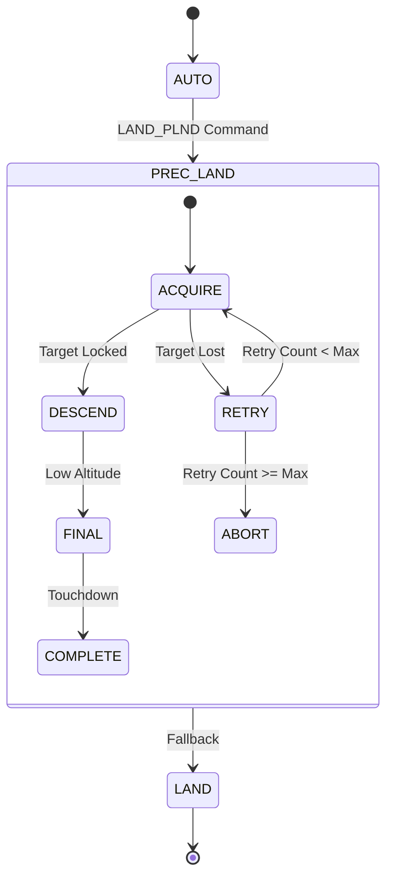

# ArduPilot Configuration

This document provides configuration guidelines for integrating Scandium with ArduPilot autopilot systems.

## Prerequisites

- ArduPilot Copter 4.3.0 or later
- Companion computer with Scandium installed
- MAVLink connection (UDP or serial)
- Camera with fixed mounting relative to vehicle frame

## ArduPilot Parameter Configuration

### Precision Landing Parameters

Configure the following parameters on the ArduPilot flight controller:

| Parameter | Value | Description |
|-----------|-------|-------------|
| PLND_ENABLED | 1 | Enable precision landing |
| PLND_TYPE | 1 | Companion computer |
| PLND_EST_TYPE | 0 | Use raw sensor data |
| PLND_LAG | 0.02 | Sensor lag compensation (seconds) |
| PLND_XY_DIST_MAX | 4.0 | Maximum horizontal distance (meters) |
| PLND_STRICT | 1 | Strict mode (require target) |
| PLND_TIMEOUT | 4.0 | Landing timeout (seconds) |
| PLND_RET_MAX | 4 | Maximum retries |
| PLND_OPTIONS | 0 | Options bitmask |

### Landing Speed Parameters

| Parameter | Value | Description |
|-----------|-------|-------------|
| LAND_SPEED | 50 | Final landing speed (cm/s) |
| LAND_SPEED_HIGH | 100 | High altitude landing speed (cm/s) |
| LAND_ALT_LOW | 1000 | Altitude for slow descent (cm) |
| LAND_REPOSITION | 0 | Disable position hold during land |

### MAVLink Parameters

| Parameter | Value | Description |
|-----------|-------|-------------|
| SERIAL2_PROTOCOL | 2 | MAVLink2 on Serial2 |
| SERIAL2_BAUD | 921 | 921600 baud |
| SR2_POSITION | 10 | Position stream rate |
| SR2_RAW_SENS | 10 | Sensor stream rate |
| SR2_RC_CHAN | 0 | Disable RC channel stream |

## Scandium Configuration for ArduPilot

### Configuration File

```yaml
# configs/ardupilot_sitl.yaml
project:
  name: Scandium
  mode: sitl
  log_level: INFO

mavlink:
  transport: udp
  udp:
    address: "127.0.0.1"
    port: 14550
  system_id: 42
  component_id: 196
  target_system_id: 1
  target_component_id: 1
  landing_target_rate_hz: 20

pose:
  frame: MAV_FRAME_BODY_NED

control:
  enable_fsm: true
  fsm_rate_hz: 20
  thresholds:
    acquire_confidence: 0.70
    align_error_m: 0.25
    abort_landability: 0.40
```

### Component ID

ArduPilot recognizes specific component IDs for precision landing:

- **196**: MAV_COMP_ID_VISUAL_INERTIAL_ODOMETRY
- **200**: Custom companion computer

Using component ID 196 enables automatic sensor fusion.

## SITL Testing

### Launch ArduPilot SITL

```bash
# Using Scandium launcher script
./scripts/run_sitl_ardupilot.sh --speedup 1 --mavproxy

# Or manually
cd ~/ardupilot
python3 Tools/autotest/sim_vehicle.py \
    --vehicle=copter \
    --frame=quad \
    --home=40.072842,32.866287,584,0 \
    -w
```

### MAVProxy Commands

```bash
# Enable precision landing
param set PLND_ENABLED 1
param set PLND_TYPE 1

# Test land command
mode LAND

# Monitor precision landing
status prec_land
```

### Run Scandium

```bash
poetry run scandium run --config configs/ardupilot_sitl.yaml
```

## Hardware Deployment

### Serial Connection

For hardware autopilots using TELEM2:

```yaml
mavlink:
  transport: serial
  serial:
    device: "/dev/ttyAMA0"  # Raspberry Pi
    baud: 921600
```

### Wiring Diagram

```
Companion Computer       ArduPilot (TELEM2)
+----------------+       +------------------+
| TX (GPIO 14) ---------> RX               |
| RX (GPIO 15) <--------- TX               |
| GND -----------+------- GND              |
+----------------+       +------------------+
```

### Camera Configuration

Example for typical downward-facing camera:

```yaml
camera:
  source: uvc
  device_index: 0
  width: 1280
  height: 720
  fps: 30
  intrinsics_path: configs/camera/calib.yaml
  extrinsics_path: configs/camera/extrinsics.yaml
```

## Precision Landing Workflow

### ArduPilot State Machine



### Flight Modes

Precision landing is available in the following modes:

| Mode | Activation | Behavior |
|------|------------|----------|
| LAND | Auto | Uses precision landing if enabled |
| AUTO | LAND_PLND command | Mission-based precision landing |
| GUIDED | MAV_CMD_NAV_LAND | Companion-controlled landing |

## Logging and Diagnostics

### ArduPilot Logs

Enable precision landing logging:

```bash
# In MAVProxy
log set PLND true
```

Log fields:

| Field | Description |
|-------|-------------|
| PLND.Healthxy | Target tracking health |
| PLND.ofsX | Target offset X |
| PLND.ofsY | Target offset Y |
| PLND.Dist | Distance to target |

### Scandium Telemetry

Enable structured logging:

```yaml
project:
  log_level: DEBUG
```

Log includes:

- Detection timestamps and confidence
- Pose estimation results
- FSM state transitions
- MAVLink message transmission

## Troubleshooting

### Target Not Acquired

1. Verify PLND_ENABLED = 1
2. Check PLND_TYPE = 1 (companion computer)
3. Confirm LANDING_TARGET messages in MAVLink stream
4. Verify target is within PLND_XY_DIST_MAX

### Precision Landing Not Activating

1. Ensure vehicle is in supported mode (LAND, AUTO, GUIDED)
2. Check PLND_STRICT setting
3. Verify sensor health in GCS
4. Confirm camera is detecting marker

### Landing Offset

1. Calibrate camera intrinsics accurately
2. Verify camera extrinsics (especially translation)
3. Check PLND_LAG parameter for sensor latency
4. Ensure camera is rigidly mounted
