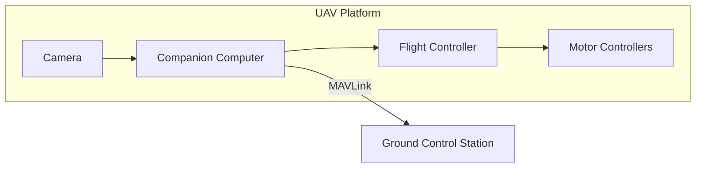

# Deployment Guide

This document provides comprehensive guidance for deploying the Scandium precision landing system in production environments.

## Deployment Architecture

### Single-Vehicle Deployment



### Components

| Component | Recommended | Notes |
|-----------|-------------|-------|
| Companion Computer | Raspberry Pi 4 (4GB+) | NVIDIA Jetson for ML |
| Camera | USB 3.0 UVC | 720p minimum |
| Flight Controller | Pixhawk 4/5 | PX4 or ArduPilot |
| Connection | Serial UART | 921600 baud |

## Hardware Setup

### Camera Installation

1. **Mounting position**: Directly below vehicle center
2. **Orientation**: Facing downward (pitch -90 degrees)
3. **Isolation**: Vibration-dampened mount recommended
4. **Protection**: Lens cover for transport

### Serial Connection

Connect companion computer to flight controller TELEM2:

| Signal | Companion | Flight Controller |
|--------|-----------|-------------------|
| TX | GPIO 14 (UART TX) | TELEM2 RX |
| RX | GPIO 15 (UART RX) | TELEM2 TX |
| GND | GND | GND |

### Power Supply

| Component | Voltage | Current |
|-----------|---------|---------|
| Companion Computer | 5.0V | 3.0A |
| Camera | 5.0V (USB) | 0.5A |
| Total | 5.0V | 3.5A |

Recommend: Dedicated 5V BEC with minimum 5A capacity.

## Software Installation

### Operating System

Recommended: Ubuntu 22.04 LTS (ARM64 for Raspberry Pi)

```bash
# Update system
sudo apt update && sudo apt upgrade -y

# Install dependencies
sudo apt install -y \
    python3.11 \
    python3.11-venv \
    libopencv-dev \
    libv4l-dev
```

### Scandium Installation

```bash
# Clone repository
git clone https://github.com/emrealtindag/scandium.git
cd scandium

# Install Poetry
curl -sSL https://install.python-poetry.org | python3 -

# Install Scandium
poetry install --without dev,docs
```

### Systemd Service

Create service file `/etc/systemd/system/scandium.service`:

```ini
[Unit]
Description=Scandium Precision Landing System
After=network.target

[Service]
Type=simple
User=scandium
Group=scandium
WorkingDirectory=/opt/scandium
ExecStart=/opt/scandium/.venv/bin/scandium run --config /opt/scandium/configs/production.yaml
Restart=on-failure
RestartSec=5
StandardOutput=journal
StandardError=journal

[Install]
WantedBy=multi-user.target
```

Enable and start:

```bash
sudo systemctl daemon-reload
sudo systemctl enable scandium
sudo systemctl start scandium
```

## Configuration

### Production Configuration

```yaml
# configs/production.yaml
project:
  name: Scandium
  run_id: auto
  mode: production
  log_level: INFO
  output_dir: /var/log/scandium

camera:
  source: uvc
  device_index: 0
  width: 1280
  height: 720
  fps: 30
  intrinsics_path: /opt/scandium/configs/camera/calibration.yaml
  extrinsics_path: /opt/scandium/configs/camera/extrinsics.yaml

mavlink:
  transport: serial
  serial:
    device: /dev/ttyAMA0
    baud: 921600
  system_id: 42
  component_id: 196
  landing_target_rate_hz: 20

control:
  enable_fsm: true
  thresholds:
    acquire_confidence: 0.75
    align_error_m: 0.20
    abort_landability: 0.45
```

### Camera Calibration

Perform camera calibration before deployment:

```bash
# Collect calibration images
python scripts/calibrate_camera.py \
    --input /data/calibration_images/ \
    --output /opt/scandium/configs/camera/calibration.yaml \
    --pattern 9x6 \
    --square-size 25
```

## Pre-Flight Checklist

### System Verification

| Check | Command | Expected |
|-------|---------|----------|
| Service status | `systemctl status scandium` | Active |
| Camera connection | `v4l2-ctl --list-devices` | Device listed |
| MAVLink connection | Check heartbeat | Connected |
| Target detection | Run diagnostics | Marker detected |

### Pre-Flight Commands

```bash
# Verify system status
poetry run scandium diagnostics --config configs/production.yaml

# Test marker detection
poetry run scandium run --config configs/production.yaml --dry-run

# Check MAVLink connection
poetry run scandium mavlink status --config configs/production.yaml
```

## Operational Procedures

### Flight Profile

1. **Takeoff**: Manual or autonomous to operating altitude
2. **Approach**: Navigate to vicinity of landing zone
3. **Search**: System searches for target marker
4. **Acquire**: Target locked, filter stabilizing
5. **Align**: Position correction to center over target
6. **Descend**: Controlled descent maintaining alignment
7. **Touchdown**: Final landing

### Abort Conditions

System will abort landing if:

- Target lost for more than 2 seconds
- Landability score below threshold (0.45)
- Human detected in landing zone
- MAVLink connection lost
- Camera failure

### Manual Override

The pilot maintains override capability at all times:

- Switch to STABILIZE or LOITER mode
- Execute go-around if unsafe
- Manual landing if automated approach fails

## Monitoring

### Real-Time Telemetry

```bash
# View structured logs
journalctl -u scandium -f

# Parse JSON logs
journalctl -u scandium -f | jq '.message'
```

### Key Metrics

| Metric | Normal Range | Alert Threshold |
|--------|--------------|-----------------|
| Detection rate | >90% | <80% |
| Pose latency | <20 ms | >50 ms |
| Filter variance | <0.5 m | >1.0 m |
| MAVLink rate | 20 Hz | <15 Hz |

## Troubleshooting

### Common Issues

| Symptom | Possible Cause | Resolution |
|---------|----------------|------------|
| No detection | Camera not connected | Check USB |
| Poor accuracy | Uncalibrated camera | Recalibrate |
| Erratic behavior | High filter variance | Check vibration |
| Connection drops | Serial issues | Check wiring |

### Log Analysis

```bash
# Extract errors from logs
journalctl -u scandium --since "1 hour ago" | grep -i error

# Export logs for analysis
journalctl -u scandium --since "today" > /tmp/scandium_logs.txt
```

## Safety Considerations

### Critical Safety Requirements

1. **Never disable geofence** for precision landing tests
2. **Maintain visual line of sight** during all operations
3. **Clear landing zone** of personnel before approach
4. **Verify failsafe configuration** on autopilot
5. **Test abort procedures** before operational use

### Risk Mitigation

| Risk | Mitigation |
|------|------------|
| Target loss | Automatic abort and hover |
| Human detection | Immediate abort |
| System failure | Revert to GPS landing |
| Communication loss | Autopilot failsafe |

### Regulatory Compliance

Ensure operations comply with:

- Local aviation authority regulations
- Airspace restrictions
- Operator certification requirements
- Privacy and data protection laws
