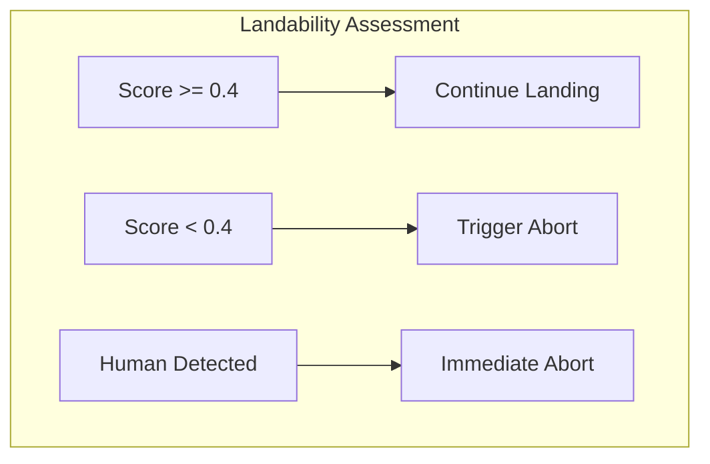

# Landability Assessment

This document describes the landability assessment system in Scandium, which evaluates landing zone safety during precision landing operations.

## Overview

The landability assessment system provides real-time evaluation of the prospective landing zone to detect potential hazards and unsafe conditions. The system operates in parallel with fiducial detection to ensure landing zone safety throughout the approach.

## Assessment Methods

Scandium supports two landability assessment methods:

| Method | Latency | Accuracy | Requirements |
|--------|---------|----------|--------------|
| Heuristic | <5 ms | Moderate | None |
| Machine Learning | <20 ms | High | ONNX model |

## Heuristic Assessment

The heuristic method uses classical computer vision techniques to evaluate landing zone characteristics.

### Texture Analysis

Texture variance indicates image quality and visibility:

```python
laplacian = cv2.Laplacian(roi, cv2.CV_64F)
texture_score = variance / threshold
```

| Variance | Interpretation | Score |
|----------|----------------|-------|
| < 12 | Insufficient texture | 0.0 - 0.5 |
| 12 - 50 | Normal texture | 0.5 - 1.0 |
| > 50 | High texture | 1.0 |

### Motion Detection

Frame difference detects moving objects in the landing zone:

```python
diff = cv2.absdiff(current_roi, previous_roi)
motion_ratio = mean(diff) / 255
```

| Motion Ratio | Interpretation | Action |
|--------------|----------------|--------|
| < 0.15 | No significant motion | Continue |
| 0.15 - 0.30 | Minor motion | Caution |
| > 0.30 | Significant motion | Flag |

### Edge Density

High edge density indicates potential obstacles:

```python
edges = cv2.Canny(roi, 50, 150)
edge_density = count(edges > 0) / total_pixels
```

| Edge Density | Interpretation | Score |
|--------------|----------------|-------|
| < 0.30 | Flat surface | 1.0 |
| 0.30 - 0.50 | Some structure | 0.5 - 1.0 |
| > 0.50 | Dense obstacles | 0.0 - 0.5 |

### Lighting Conditions

Mean intensity detects insufficient lighting:

```python
mean_intensity = mean(roi)
light_score = intensity / threshold
```

| Intensity | Interpretation | Action |
|-----------|----------------|--------|
| < 30 | Very low light | Flag |
| 30 - 80 | Low light | Caution |
| > 80 | Adequate light | Continue |

### Aggregate Score

The final landability score combines all factors:

```python
score = (
    0.30 * texture_score +
    0.30 * motion_score +
    0.20 * edge_score +
    0.20 * light_score
)
```

## Machine Learning Assessment

The ML-based method uses a trained segmentation model to classify landing zones.

### Model Architecture

Supported model format: ONNX

Input specifications:

| Parameter | Value |
|-----------|-------|
| Input size | 256 x 256 |
| Channels | 3 (BGR) |
| Normalization | 0-1 scaling |
| Format | NCHW |

Output specifications:

| Parameter | Value |
|-----------|-------|
| Output size | 256 x 256 |
| Channels | 1 (segmentation mask) |
| Values | 0.0 - 1.0 (safety probability) |

### Configuration

```yaml
landability:
  method: ml
  ml:
    model_path: models/landability_seg.onnx
    device: cpu  # or cuda
    score_threshold: 0.6
```

### Training Data Requirements

For custom model training:

| Category | Examples | Label |
|----------|----------|-------|
| Safe zones | Flat grass, concrete | 1.0 |
| Obstacles | Vehicles, structures | 0.0 |
| Humans | Pedestrians | 0.0 |
| Uncertain | Partial occlusion | 0.5 |

## Safety Flags

The landability system generates the following flags:

| Flag | Severity | Trigger | Action |
|------|----------|---------|--------|
| `insufficient_texture` | Warning | Low texture variance | Monitor |
| `high_motion` | Warning | Motion detected | Reduce descent |
| `high_edge_density` | Warning | Many edges | Evaluate |
| `low_light` | Warning | Insufficient lighting | Caution |
| `human_present` | Critical | Human detected | Abort |
| `vehicle_present` | Critical | Vehicle detected | Abort |
| `ml_unsafe_zone` | Warning | ML low confidence | Evaluate |

## Integration with FSM

The landability score influences FSM state transitions:



### Configuration Thresholds

```yaml
control:
  thresholds:
    abort_landability: 0.40
```

## ROI Selection

The region of interest (ROI) for landability assessment:

1. **Default**: Center of frame, 1/4 frame dimensions
2. **Marker-relative**: Centered on detected marker, scaled by marker size
3. **Expanding**: Increases with decreasing altitude

```python
roi_center = marker_center or frame_center
roi_size = marker_size * scale_factor or (width // 4, height // 4)
```

## Performance Considerations

### Computational Cost

| Method | CPU Time | GPU Time | Memory |
|--------|----------|----------|--------|
| Heuristic | 3-5 ms | N/A | 10 MB |
| ML (256x256) | 15-20 ms | 2-5 ms | 100 MB |

### Optimization Strategies

1. **Downsampling**: Process at reduced resolution
2. **Skip frames**: Assess every Nth frame
3. **Async processing**: Parallelize with detection
4. **GPU acceleration**: Use CUDA for ML inference

## Testing

### Unit Tests

```bash
pytest tests/unit/test_landability.py -v
```

### Synthetic Testing

```python
# Generate test cases
frame = create_synthetic_frame(
    obstacle_count=0,
    motion_level=0.0,
    lighting=128,
)

result = estimator.estimate(frame)
assert result.is_safe
```

### Field Validation

Recommended validation procedure:

1. Collect diverse landing zone imagery
2. Label ground truth safety status
3. Run assessment on labeled data
4. Compute precision/recall metrics
5. Adjust thresholds based on operational requirements
