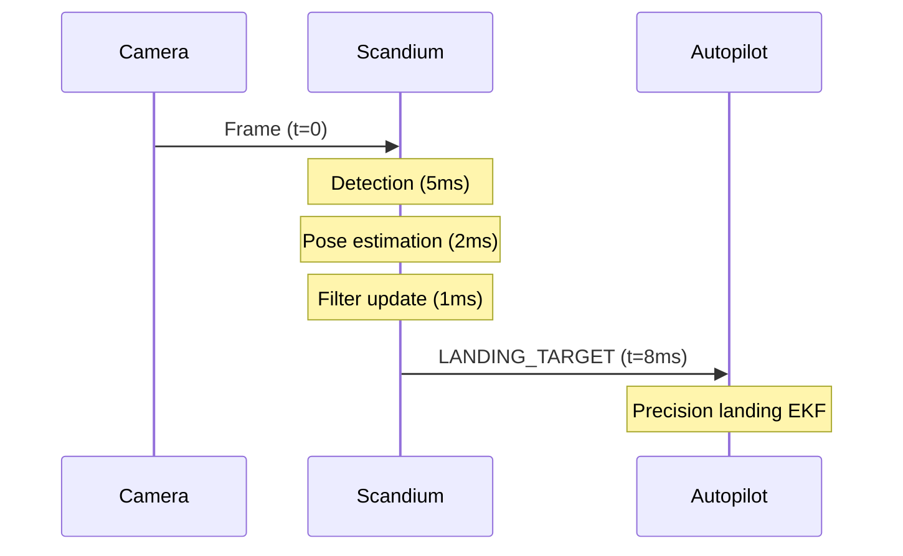

# MAVLink Integration

This document provides comprehensive technical reference for the MAVLink protocol implementation in the Scandium precision landing system.

## Protocol Overview

Scandium implements the MAVLink 2.0 protocol for communication with autopilot systems. The primary message used for precision landing is LANDING_TARGET (#149), which conveys target position and orientation information to the autopilot's precision landing subsystem.

## Message Specifications

### LANDING_TARGET (#149)

The LANDING_TARGET message provides target position information to the autopilot. Scandium supports both angle-based and position-based modes.

#### Field Definitions

| Field | Type | Units | Description |
|-------|------|-------|-------------|
| time_usec | uint64_t | us | Timestamp (UNIX epoch, microseconds) |
| target_num | uint8_t | - | Target ID (use 0 for primary target) |
| frame | uint8_t | - | MAV_FRAME enum value |
| angle_x | float | rad | X-axis angular offset from center of image |
| angle_y | float | rad | Y-axis angular offset from center of image |
| distance | float | m | Distance to the target |
| size_x | float | rad | Target apparent size in X direction |
| size_y | float | rad | Target apparent size in Y direction |
| x | float | m | X position in specified frame |
| y | float | m | Y position in specified frame |
| z | float | m | Z position in specified frame |
| q | float[4] | - | Quaternion (w, x, y, z) |
| type | uint8_t | - | LANDING_TARGET_TYPE enum |
| position_valid | uint8_t | - | Boolean flag for position validity |

#### Coordinate Frame Selection

Scandium supports multiple MAVLink coordinate frames:

| Frame | Value | Description | Use Case |
|-------|-------|-------------|----------|
| MAV_FRAME_LOCAL_NED | 1 | North-East-Down local frame | Position relative to home |
| MAV_FRAME_BODY_NED | 8 | Forward-Right-Down body frame | Camera-derived position |
| MAV_FRAME_BODY_FRD | 12 | Forward-Right-Down (PX4) | PX4-specific frame |

#### Angle Calculation

Angular offsets are computed from the camera-frame translation vector:

```
angle_x = arctan2(t_x, t_z)  # Horizontal angle (positive = right)
angle_y = arctan2(t_y, t_z)  # Vertical angle (positive = down)
```

Where `(t_x, t_y, t_z)` is the target position in the camera frame.

### HEARTBEAT (#0)

Scandium sends periodic heartbeat messages to maintain connection state with the autopilot.

| Field | Value | Description |
|-------|-------|-------------|
| type | MAV_TYPE_ONBOARD_CONTROLLER (18) | Companion computer |
| autopilot | MAV_AUTOPILOT_INVALID (8) | Not an autopilot |
| base_mode | 0 | Not applicable |
| custom_mode | 0 | Not applicable |
| system_status | MAV_STATE_ACTIVE (4) | System active |

## Transport Configuration

### UDP Transport

```yaml
mavlink:
  transport: udp
  udp:
    address: "127.0.0.1"
    port: 14550
```

UDP is recommended for SITL testing and high-bandwidth scenarios.

### Serial Transport

```yaml
mavlink:
  transport: serial
  serial:
    device: "/dev/ttyAMA0"
    baud: 921600
```

Serial transport is required for hardware autopilot connections.

## System Identification

Scandium uses the following default system and component IDs:

| Parameter | Default | Description |
|-----------|---------|-------------|
| system_id | 42 | Scandium system ID |
| component_id | 200 | LANDING_TARGET component |
| target_system_id | 1 | Target autopilot system |
| target_component_id | 1 | Target autopilot component |

Configure these values to match your system architecture:

```yaml
mavlink:
  system_id: 42
  component_id: 200
  target_system_id: 1
  target_component_id: 1
```

## Publishing Rate

The LANDING_TARGET publishing rate is configurable:

```yaml
mavlink:
  landing_target_rate_hz: 20
```

Recommended rates:

| Autopilot | Minimum | Recommended | Maximum |
|-----------|---------|-------------|---------|
| ArduPilot | 10 Hz | 20 Hz | 50 Hz |
| PX4 | 10 Hz | 30 Hz | 50 Hz |

## Connection Monitoring

Scandium monitors the MAVLink connection through heartbeat tracking:

1. **Outbound heartbeat**: Sent at 1 Hz to indicate companion computer presence
2. **Inbound heartbeat**: Monitored to detect autopilot availability
3. **Timeout detection**: Connection considered lost after 3 seconds without heartbeat

Upon connection loss, the FSM transitions to FAILSAFE state.

## Message Timing

For optimal precision landing performance, ensure proper timing alignment:



The `time_usec` field should reflect the camera timestamp, not the transmission time, to enable proper sensor fusion on the autopilot.

## Compatibility Matrix

| Feature | ArduPilot 4.3+ | PX4 1.13+ |
|---------|----------------|-----------|
| LANDING_TARGET | Supported | Supported |
| Angle-based mode | Supported | Supported |
| Position-based mode | Supported | Supported |
| MAV_FRAME_BODY_NED | Supported | Supported |
| MAV_FRAME_BODY_FRD | Limited | Preferred |

## Troubleshooting

### No Target Messages Received

1. Verify network connectivity (UDP) or serial connection
2. Check system/component ID configuration
3. Ensure heartbeat exchange is occurring
4. Verify target is detected in perception logs

### Erratic Landing Behavior

1. Check for timestamp discontinuities
2. Verify coordinate frame configuration
3. Confirm camera calibration accuracy
4. Review filter parameters for appropriate smoothing

### Connection Drops

1. Increase heartbeat timeout threshold
2. Check for network congestion (UDP)
3. Verify serial connection stability
4. Monitor system resource utilization
