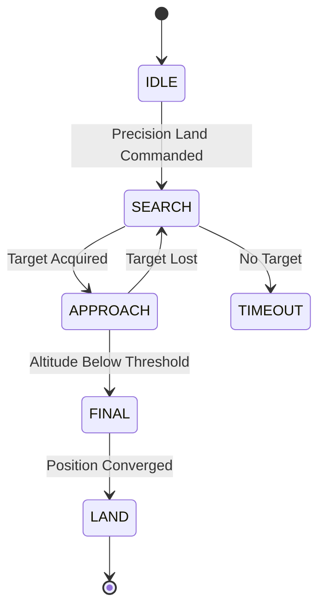

# PX4 Configuration

This document provides configuration guidelines for integrating Scandium with PX4 autopilot systems.

## Prerequisites

- PX4 Autopilot v1.13.0 or later
- Companion computer with Scandium installed
- MAVLink connection (UDP or serial)
- Camera with fixed mounting relative to vehicle frame

## PX4 Parameter Configuration

### Precision Landing Parameters

Configure the following parameters on the PX4 flight controller:

| Parameter | Value | Description |
|-----------|-------|-------------|
| PLD_BTOUT | 5.0 | Beacon search timeout (seconds) |
| PLD_FAPPR_ALT | 10.0 | Final approach altitude (meters) |
| PLD_HACC_RAD | 0.25 | Horizontal acceptance radius (meters) |
| PLD_MAX_SRCH | 1.0 | Maximum horizontal search velocity (m/s) |
| PLD_SRCH_ALT | 15.0 | Search altitude (meters) |
| PLD_SRCH_TOUT | 10.0 | Search timeout (seconds) |

### Landing Configuration

| Parameter | Value | Description |
|-----------|-------|-------------|
| MPC_LAND_SPEED | 0.7 | Landing descent speed (m/s) |
| MPC_LAND_ALT1 | 10.0 | Slow landing altitude (meters) |
| MPC_LAND_ALT2 | 5.0 | Very slow landing altitude (meters) |
| RTL_LAND_DELAY | 0.0 | Land immediately on RTL |
| RTL_DESCEND_ALT | 15.0 | RTL descent altitude (meters) |

### MAVLink Configuration

| Parameter | Value | Description |
|-----------|-------|-------------|
| MAV_1_CONFIG | TELEM 2 | MAVLink on TELEM2 |
| MAV_1_MODE | Onboard | Companion computer mode |
| MAV_1_RATE | 50000 | Telemetry rate (bytes/s) |
| SER_TEL2_BAUD | 921600 | Serial baud rate |

## Scandium Configuration for PX4

### Configuration File

```yaml
# configs/px4_sitl.yaml
project:
  name: Scandium
  mode: sitl
  log_level: INFO

mavlink:
  transport: udp
  udp:
    address: "127.0.0.1"
    port: 14540
  system_id: 42
  component_id: 200
  target_system_id: 1
  target_component_id: 1
  landing_target_rate_hz: 30

pose:
  frame: MAV_FRAME_BODY_FRD

control:
  enable_fsm: true
  fsm_rate_hz: 30
  thresholds:
    acquire_confidence: 0.70
    align_error_m: 0.20
    abort_landability: 0.40
```

### Coordinate Frame

PX4 prefers MAV_FRAME_BODY_FRD (Forward-Right-Down) for precision landing:

```yaml
pose:
  frame: MAV_FRAME_BODY_FRD
```

## SITL Testing

### Launch PX4 SITL

```bash
# Using Scandium launcher script
./scripts/run_sitl_px4.sh --airframe iris --headless

# Or manually
cd ~/PX4-Autopilot
make px4_sitl_default gazebo-classic
```

### Configure QGroundControl

1. Open QGroundControl
2. Navigate to Vehicle Setup > Parameters
3. Set precision landing parameters as specified above
4. Reboot the vehicle

### Run Scandium

```bash
poetry run scandium run --config configs/px4_sitl.yaml
```

## Hardware Deployment

### Serial Connection

For hardware PX4 autopilots, use serial transport:

```yaml
mavlink:
  transport: serial
  serial:
    device: "/dev/ttyUSB0"
    baud: 921600
```

### Camera Mounting

1. Mount camera facing downward on the vehicle frame
2. Ensure rigid connection to minimize vibration effects
3. Configure camera extrinsics to match physical mounting

### Extrinsics Configuration

Example for downward-facing camera:

```yaml
# configs/camera/extrinsics_px4.yaml
rotation_matrix:
  - [1.0, 0.0, 0.0]
  - [0.0, 1.0, 0.0]
  - [0.0, 0.0, 1.0]
translation: [0.0, 0.0, 0.05]
```

## Precision Landing Workflow

### PX4 State Machine



### Integration Points

1. **Scandium publishes** LANDING_TARGET messages continuously
2. **PX4 EKF** fuses target position with onboard sensors
3. **Position controller** generates velocity commands to track target
4. **Precision landing mode** manages descent and final approach

## Troubleshooting

### Target Not Tracking

1. Verify LANDING_TARGET messages are received (check MAVLink Inspector)
2. Confirm coordinate frame matches PX4 expectation (MAV_FRAME_BODY_FRD)
3. Check position_valid flag is set to 1

### Large Landing Error

1. Calibrate camera intrinsics with checkerboard
2. Verify camera extrinsics match physical mounting
3. Increase filter alpha for faster response
4. Reduce approach speed for better convergence

### Unstable Descent

1. Reduce MPC_LAND_SPEED parameter
2. Increase landing_target_rate_hz to 30+ Hz
3. Check for vibration-induced pose noise
4. Verify filter is adequately damping noise
