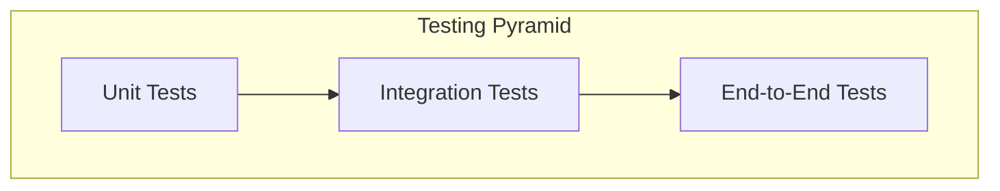

# Testing Guide

This document describes the testing strategy, procedures, and infrastructure for the Scandium precision landing system.

## Testing Pyramid

Scandium employs a comprehensive testing pyramid:



| Level | Count | Execution Time | Coverage |
|-------|-------|----------------|----------|
| Unit | ~100 | <30 seconds | 70%+ |
| Integration | ~20 | 2-5 minutes | Critical paths |
| End-to-End | ~5 | 10-30 minutes | Full scenarios |

## Unit Tests

### Structure

```
tests/
├── __init__.py
├── conftest.py           # Shared fixtures
├── unit/
│   ├── __init__.py
│   ├── test_config_schema.py
│   ├── test_frames.py
│   ├── test_filtering.py
│   ├── test_aruco_detector.py
│   └── test_landing_target_encode.py
└── integration/
    ├── __init__.py
    ├── test_pipeline_no_hw.py
    └── test_scenario_smoke.py
```

### Running Unit Tests

```bash
# All unit tests
poetry run pytest tests/unit/ -v

# Specific test file
poetry run pytest tests/unit/test_frames.py -v

# With coverage
poetry run pytest tests/unit/ --cov=src/scandium --cov-report=html
```

### Writing Unit Tests

Follow these conventions:

```python
"""Unit tests for module_name.py."""

import pytest
import numpy as np

from scandium.module import function_under_test


class TestFunctionName:
    """Tests for function_name."""

    def test_nominal_case(self) -> None:
        """Test normal operation."""
        result = function_under_test(valid_input)
        assert result == expected_output

    def test_edge_case(self) -> None:
        """Test boundary conditions."""
        result = function_under_test(edge_input)
        assert result is not None

    def test_error_handling(self) -> None:
        """Test exception behavior."""
        with pytest.raises(ValueError):
            function_under_test(invalid_input)
```

## Integration Tests

### Hardware-Free Integration

Test complete pipelines without physical hardware:

```python
"""Integration tests without hardware dependencies."""

import pytest
import numpy as np

from scandium.perception.camera import Frame
from scandium.perception.fiducials import ArUcoDetector
from scandium.perception.pose import estimate_pose_from_corners


class TestPipelineNoHardware:
    """Integration tests for perception pipeline."""

    def test_detection_to_pose(self) -> None:
        """Test fiducial detection to pose estimation."""
        # Generate synthetic frame with marker
        frame = self._create_synthetic_frame()
        
        # Run detection
        detector = ArUcoDetector(dictionary="DICT_4X4_100")
        detections = detector.detect(frame.to_gray())
        
        assert len(detections) > 0
        
        # Run pose estimation
        pose = estimate_pose_from_corners(
            detections[0].corners,
            marker_size_m=0.2,
            intrinsics=self._get_intrinsics(),
        )
        
        assert pose.success
        assert pose.distance_m > 0
```

### Running Integration Tests

```bash
# All integration tests
poetry run pytest tests/integration/ -v

# With markers for slow/hardware tests
poetry run pytest tests/integration/ -v -m "not slow"
```

## Scenario Tests

### Structure

Scenarios are defined in YAML and executed by the scenario runner:

```yaml
# configs/scenarios/smoke.yaml
id: smoke
name: Smoke Test
description: Basic validation

steps:
  - name: Initialize
    action: initialize
    expected:
      config_loaded: true
      
  - name: Detect Marker
    action: wait_detection
    params:
      max_wait_s: 30
    expected:
      marker_detected: true
```

### Running Scenarios

```bash
# Run smoke test
poetry run scandium scenario run --id smoke

# Run with verbose output
poetry run scandium scenario run --id smoke --verbose
```

## Property-Based Testing

Scandium uses Hypothesis for property-based testing:

```python
from hypothesis import given, strategies as st
import numpy as np

from scandium.perception.pose.filtering import ExpSmoother


class TestExpSmootherProperties:
    """Property-based tests for ExpSmoother."""

    @given(st.floats(min_value=0.01, max_value=1.0))
    def test_alpha_bounds(self, alpha: float) -> None:
        """Test that any valid alpha produces valid output."""
        smoother = ExpSmoother(alpha=alpha)
        measurement = np.array([1.0, 2.0, 3.0])
        result = smoother.update(measurement)
        assert result.is_valid

    @given(st.lists(st.floats(min_value=-100, max_value=100), min_size=3, max_size=3))
    def test_output_bounded(self, values: list) -> None:
        """Test that filter output is bounded by inputs."""
        smoother = ExpSmoother(alpha=0.5)
        measurement = np.array(values)
        result = smoother.update(measurement)
        # First measurement equals input
        assert np.allclose(result.position, measurement)
```

## Mocking and Fixtures

### Shared Fixtures

```python
# tests/conftest.py
import pytest
import numpy as np

from scandium.perception.camera import Frame
from scandium.perception.calib import CameraIntrinsics


@pytest.fixture
def sample_frame() -> Frame:
    """Create sample BGR frame."""
    image = np.zeros((720, 1280, 3), dtype=np.uint8)
    return Frame(image_bgr=image, timestamp_s=0.0, frame_id=0)


@pytest.fixture
def default_intrinsics() -> CameraIntrinsics:
    """Create default camera intrinsics."""
    return CameraIntrinsics(
        fx=1280.0, fy=1280.0,
        cx=640.0, cy=360.0,
        dist_coeffs=np.zeros(5),
    )
```

### Mocking MAVLink

```python
from unittest.mock import Mock, patch

def test_landing_target_send():
    """Test LANDING_TARGET message sending."""
    transport = Mock()
    transport.mav = Mock()
    
    publisher = LandingTargetPublisher(transport)
    publisher.publish(data)
    
    transport.mav.landing_target_send.assert_called_once()
```

## Coverage Requirements

### Targets

| Category | Minimum | Target |
|----------|---------|--------|
| Overall | 70% | 85% |
| Core modules | 80% | 90% |
| Safety-critical | 90% | 95% |

### Generating Reports

```bash
# Generate HTML coverage report
poetry run pytest tests/ --cov=src/scandium --cov-report=html

# Open report
open htmlcov/index.html
```

## Continuous Integration

Tests are executed automatically on every push:

```yaml
# .github/workflows/ci.yml
test:
  runs-on: ubuntu-latest
  steps:
    - uses: actions/checkout@v4
    - name: Set up Python
      uses: actions/setup-python@v5
      with:
        python-version: "3.11"
    - name: Install dependencies
      run: poetry install --with dev
    - name: Run tests
      run: poetry run pytest tests/ --cov=src/scandium
```

## Test Data Management

### Synthetic Data Generation

```python
def generate_aruco_marker_image(
    marker_id: int,
    size: int = 200,
    margin: int = 50,
) -> np.ndarray:
    """Generate image containing ArUco marker."""
    aruco_dict = cv2.aruco.getPredefinedDictionary(cv2.aruco.DICT_4X4_100)
    marker = cv2.aruco.generateImageMarker(aruco_dict, marker_id, size)
    
    # Add margin
    result = np.ones((size + 2*margin, size + 2*margin), dtype=np.uint8) * 255
    result[margin:margin+size, margin:margin+size] = marker
    
    return cv2.cvtColor(result, cv2.COLOR_GRAY2BGR)
```

### Recording Test Data

For regression testing, record real sensor data:

```bash
# Record camera frames
poetry run scandium record --output data/test_sequence/ --duration 60

# Use in tests
frame = load_recorded_frame("data/test_sequence/frame_0001.npz")
```
